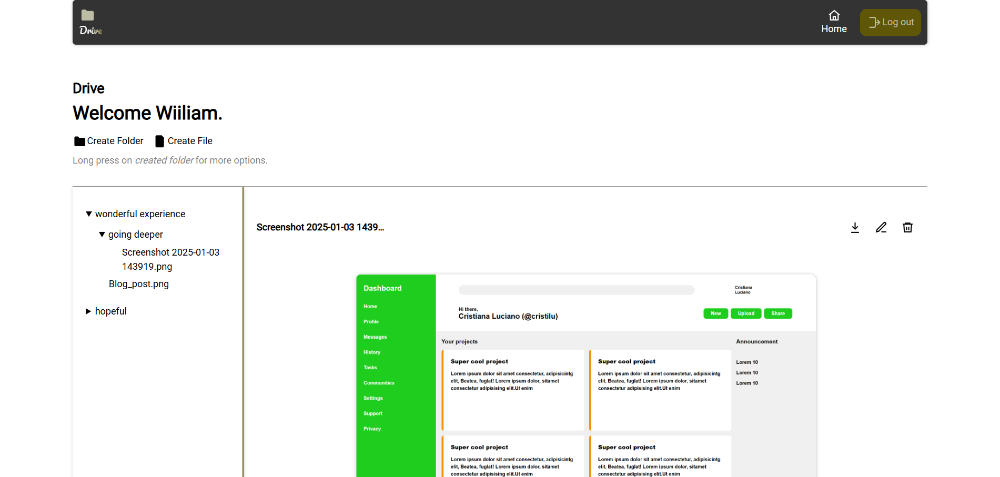
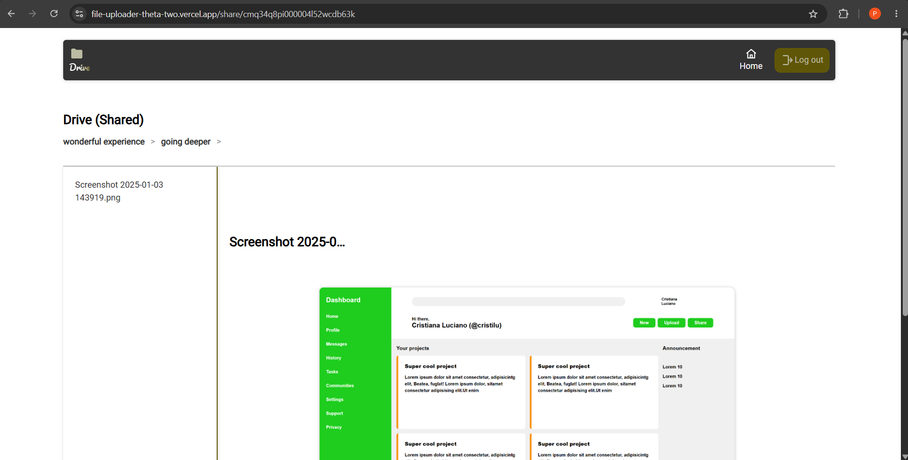

# File Uploader

A cloud-based file storage application inspired by Google Drive, built as part of [The Odin Project NodeJS Curriculum](https://www.theodinproject.com/lessons/nodejs-file-uploader).

Users can securely upload files, organize them into folders, share folders through public links, and manage their storage through an intuitive interface.

## Live Demo

[Live Site](https://file-uploader-theta-two.vercel.app/)

[Source Code](https://github.com/PRINCE-OBOT/file-uploader.git)

---

## Features

### Authentication

* User registration and login
* Session-based authentication using Passport.js
* Persistent sessions stored in PostgreSQL

### Folder Management

* Create folders
* Rename folders
* Delete folders
* Organize files inside folders

### File Management

* Upload multiple files
* Store files in Cloudinary
* View uploaded file details
* Download files
* File size validation

### Sharing

* Generate public folder sharing links
* Set expiration dates for shared folders
* Access shared folders without authentication

### Security

* Protected routes for authenticated users
* Server-side validation
* Session-based authentication
* Secure file handling

---

## Built With

### Backend

* Node.js
* Express.js
* Prisma ORM
* PostgreSQL
* Passport.js
* Express Session
* Multer
* Cloudinary

### Frontend

* EJS
* CSS
* JavaScript

### Deployment

* Vercel
* Supabase PostgreSQL

---

## Database Design

### User

* Account information
* Authentication data
* Folder ownership

### Folder

* Folder name
* Parent-child relationships
* Shared link configuration
* Expiration date

### File

* File metadata
* Cloudinary URL
* File size
* Upload timestamp
* Folder association

---

## What I Learned

This project provided hands-on experience with:

* File uploads with Multer
* Cloud storage integration with Cloudinary
* Relational database design using Prisma ORM
* Managing file metadata
* Deploying full-stack applications with Vercel and Supabase PostgreSQL

---

## Challenge

The biggest challenge in this project was deployment. While the application worked correctly in development, configuring Prisma ORM to work with PostgreSQL, Vercel, and Supabase in a production environment required significant troubleshooting. Despite following guidance from AI tools, I encountered several deployment issues, which TOP guided me to resolve.

## `.env`

```env
DATABASE_URL=
DIRECT_URL=

SESSION_SECRET=

CLOUDINARY_CLOUD_NAME=
CLOUDINARY_API_KEY=
CLOUDINARY_API_SECRET=
```

## Acknowledgements

This project was completed as part of the NodeJS course from [The Odin Project](https://www.theodinproject.com).

---

### Screenshots

**Dashboard**



**Shared Folder**


